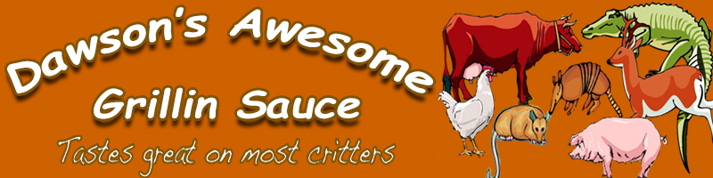
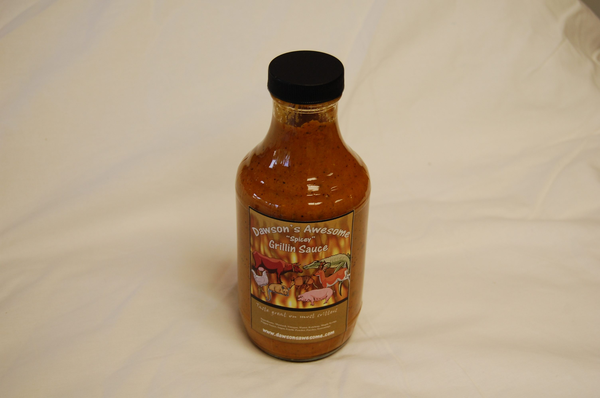

<!DOCTYPE html>
<html lang="en">
<head>
    <meta charset="UTF-8">
    <meta name="viewport" content="width=device-width, initial-scale=1.0">
    <title>Dawson's Awesome | Original Grillin' Sauce</title>
    
    
</head>
<body>
    

        
    

    <nav>
        <ul>
            <li><a href="shop.html">Shop</a></li>
            <li><a href="contact.html">Contact</a></li>
            <li><a href="story.html">Story</a></li>
        </ul>
    </nav>

    <main>
        

            <h1>The Original  Grillin' Sauce</h1>
            
Hand-crafted in small batches with premium ingredients. Dawson's Awesome brings a smoky, tangy, and perfectly sweet balance to every flame-grilled meal. It's not just sauce; it's a legacy of flavor.

            <a href="shop.html" class="cta-button">Order Your Bottle</a>
        

        

            
        

    </main>

    <footer>
        
&copy; 2026 Dawson's Awesome. All Rights Reserved. | Made for the love of BBQ.

    </footer>

</body>
</html>
